# 基于 LoRA 与 RAG 的校园智能问答助手

## 大模型微调与优化课程大作业个人报告

**提交模式**：模式二——个人提交  
**技术方向**：方向 A——垂直领域微调  
**项目名称**：基于 LoRA 与 RAG 的校园智能问答助手  
**基础模型**：Qwen2.5-1.5B-Instruct  
**微调方法**：LoRA 参数高效微调  
**检索增强**：ChromaDB 向量知识库  
**姓名**：连冠权  
**学号**：20233801060  
**提交日期**：2026 年 6 月 23 日  
**GitHub 地址**：待补充：[`https://github.com/<账号>/campus-lora-rag-qa`](https://github.com/risinglian/campus-lora-rag-qa)

> **真实性说明**：本报告依据远程项目 `/root/autodl-tmp/llm_workspace` 的真实文件、运行日志与评估结果撰写。已核验数据集、LoRA adapter、RAG 代码、ChromaDB 检索、12 题三模式评估与可训练参数统计。当前项目实际 RAG embedding 为 `HashEmbeddingFunction`，不是 BGE；本文不将 Hash 方案伪写为 BGE。若后续替换为 BGE，必须重建向量库并重新运行同一套评估。

---

## 摘要

本项目面向校园服务问答场景，构建了一个结合 LoRA 微调与 RAG 检索增强的校园智能问答助手。项目以 Qwen2.5-1.5B-Instruct 为基础模型，使用 240 条校园问答数据进行 LoRA 参数高效微调，使模型更熟悉校园服务类问题的表达方式、步骤化结构和办事流程口径；同时使用 ChromaDB 构建校园知识库，在推理阶段检索图书馆、教务、校园卡、宿舍等相关资料并注入 Prompt，以提升回答的事实依据和可维护性。

为了验证不同技术模块的实际作用，本项目实现并对比了 Base、LoRA、LoRA+RAG 三种推理模式。评估集包含 12 个问题，覆盖域内已见问题、域内泛化问题、域外拒答、通用能力、指令遵循和综合问题。实验结果显示，LoRA+RAG 的平均分为 4.58，高质量回答率为 91.7%，域内问题平均分达到 5.00，优于 Base 与单独 LoRA。与此同时，实验也暴露出当前系统的不足：单独 LoRA 并不总是优于基础模型，域外拒答仍不稳定，Hash embedding 的语义检索能力有限。综合来看，本项目完成了垂直领域数据构建、LoRA 微调、RAG 检索、三模式对比和边界分析，能够较完整地体现大模型微调与优化课程的核心要求。

---

## 一、项目背景与选题动机

校园服务信息通常分散在图书馆、教务系统、校园卡平台、宿舍管理、就业服务等多个入口。学生在真实使用时往往不会按照制度文件标题提问，而是会使用口语化表达，例如“饭卡不见了先挂失还是补办”“周末晚上还能不能去图书馆自习”“宿舍灯坏了找谁修”。通用大模型虽然具备较强语言生成能力，但不天然掌握具体学校制度，容易给出泛化建议，甚至把不同学校或不同场景的规则混在一起。对校园服务类问题而言，回答不仅要通顺，还要尽量贴近实际办事流程，并在缺乏依据时避免乱编。

因此，本项目选择“校园智能问答助手”作为垂直领域微调任务。项目目标不是替代官方通知，而是在课程实验条件下验证三个问题：第一，LoRA 微调能否让基础模型形成更稳定的校园问答表达格式；第二，RAG 检索能否为制度类问题提供更明确的外部依据；第三，LoRA 与 RAG 结合后，是否比单独使用基础模型或单独加载 LoRA adapter 更适合校园服务问答。

本项目最终实现三种可对比的推理模式。Base 模式直接调用 Qwen2.5-1.5B-Instruct，用于观察基础模型原始能力；LoRA 模式加载校园问答微调后的 adapter，用于观察微调对回答风格和领域表达的影响；LoRA+RAG 模式先从 ChromaDB 检索校园知识，再将参考资料与用户问题共同输入 LoRA 模型，用于观察完整系统的实际效果。三种模式使用同一测试集进行评估，保证对比尽量公平。

---

## 二、系统架构设计

系统由数据层、微调层、知识检索层、推理生成层和评估层组成。整体流程如下：

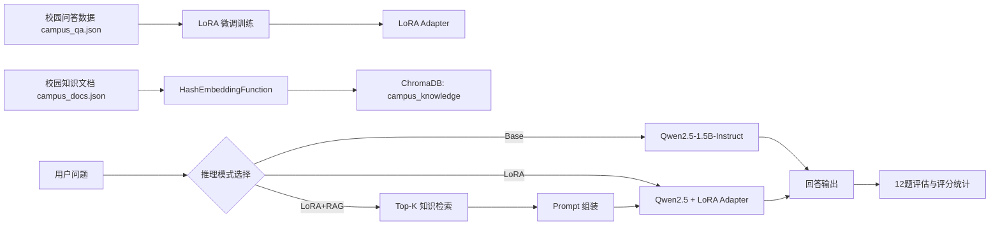

数据层包含两类数据：一类是用于微调的 `campus_qa.json`，提供 instruction、input、output 格式的校园问答样本；另一类是用于 RAG 的 `campus_docs.json`，保存校园服务知识文档。微调层通过 LLaMA-Factory 对基础模型进行 LoRA 训练，只保存 adapter 权重，不复制完整基础模型。知识检索层使用 ChromaDB 持久化校园知识库。推理层由 `main.py` 统一管理三种模式，使同一个问题可以在 Base、LoRA、LoRA+RAG 三种设置下进行公平对比。评估层通过 12 个固定问题和 1～5 分评分标准统计平均分、高质量回答率、域内得分、域外拒答成功率和指令遵循表现。

这种架构的核心思想是“微调管表达，检索管事实”。LoRA 负责让模型学会校园服务问答的回答习惯，例如先说明处理步骤、再提醒以官方通知为准；RAG 负责提供可更新的知识依据，例如图书馆开放、校园卡挂失、宿舍报修等规则。两者结合后，系统既不是只依赖模型记忆，也不是简单检索复制，而是在检索资料的约束下生成更自然的回答。

---

## 三、技术选型说明

本项目在方案设计阶段比较了 Base、纯 LoRA、纯 RAG、LoRA+RAG 四种路线。Base 模式部署成本最低，但无法保证掌握学校具体规定；纯 LoRA 可以通过样本学习校园问答风格，但知识更新不灵活，若学校制度变化需要重新整理训练数据甚至重新训练；纯 RAG 可以快速更新知识库，但回答风格和边界控制仍主要依赖基础模型；LoRA+RAG 则能让二者互补，既通过微调改善回答结构，又通过检索减少事实幻觉。

| 方案 | 主要作用 | 优点 | 局限 | 本项目用途 |
| --- | --- | --- | --- | --- |
| Base | 原始模型基线 | 无需训练，便于对比 | 校园知识不足，容易泛化 | 基线模式 |
| 纯 LoRA | 学习校园问答风格 | 参数量小，训练成本低 | 知识更新不灵活，可能记忆不足 | 消融对比模式 |
| 纯 RAG | 检索外部知识 | 知识可更新，事实依据更强 | 检索错误会影响回答，风格不稳定 | 检索模块基础 |
| LoRA+RAG | 微调模型结合检索资料 | 兼顾表达风格与知识依据 | 工程复杂度更高 | 最终方案 |

选择 LoRA 的原因主要有三点。第一，方向 A 要求完成 LoRA/QLoRA 微调，LoRA 能直接体现对参数高效微调方法的掌握。第二，Qwen2.5-1.5B-Instruct 规模适中，适合在单张 4090D 上完成实验，不需要像全参数微调那样消耗大量显存。第三，校园问答数据量为 240 条，更适合使用参数高效微调来调整回答风格，而不是对全模型进行大规模训练。

选择 RAG 的原因也很明确。校园制度类知识具有时效性，图书馆开放时间、补退选流程、校园卡服务入口等内容后续可能调整。如果把所有知识都依赖微调记忆，更新成本较高；而 RAG 只需要更新知识文档并重建向量库，就能在不重新训练 adapter 的情况下改善回答依据。因此，本项目最终采用 LoRA+RAG，并保留 Base 与 LoRA 模式作为消融对比。

---

## 四、技术实现说明

### 4.1 实验环境与项目文件

实验在 AutoDL 远程服务器完成，工作目录为 `/root/autodl-tmp/llm_workspace`。环境核验结果保存于 `report/evidence/01_env.log`。实际环境为 Python 3.10.20、PyTorch 2.4.0+cu121、Transformers 4.45.2、PEFT 0.19.1、ChromaDB 1.5.9、sentence-transformers 5.6.0。GPU 为 NVIDIA GeForce RTX 4090 D，显存 24564 MiB。

项目关键文件包括 `data/campus_qa.json`、`data/campus_docs.json`、`configs/lora_sft.yaml`、`src/rag_utils.py`、`scripts/build_chroma_db.py`、`main.py` 和 `eval_results/compare_12_latest.md`。LoRA 输出目录为 `outputs/qwen25-1.5b-campus-lora`，其中包含 `adapter_config.json` 和 `adapter_model.safetensors`。这些文件共同构成从训练、检索到评估的完整闭环。

#### 截图证据

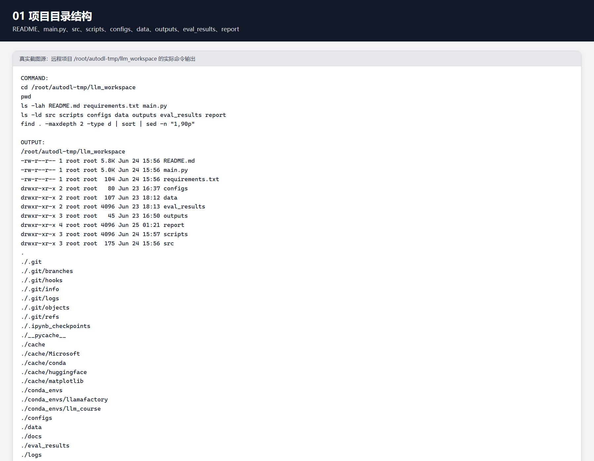

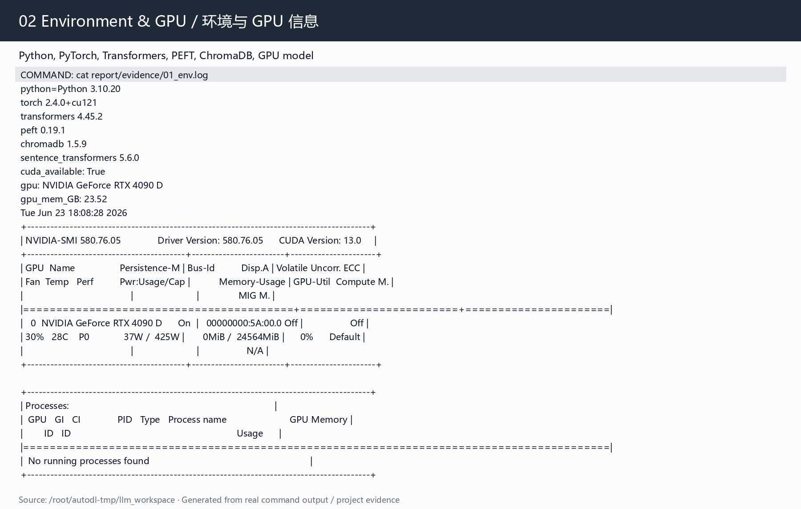

### 4.2 数据集构建与检查

微调数据集为 `data/campus_qa.json`，共 240 条样本。每条样本包含 `instruction`、`input`、`output` 字段，缺失必要字段数量为 0，完整重复记录数量为 0。数据覆盖图书馆、教务、校园卡、宿舍服务等校园高频事项。构造方式不是只写少量标准问答，而是围绕 12 类校园场景扩展多种问法，使模型不仅记住单一提问形式，也能适应“饭卡不见了”“宿舍灯坏了”这类口语化表达。

训练集与验证集划分为 216 条和 24 条。这样的划分保证大部分样本用于训练，同时保留一部分样本观察微调后是否只是在训练集上记忆答案。由于数据规模较小，报告中不夸大模型泛化能力，而是通过 12 个固定测试问题进一步验证系统在不同类型问题上的表现。

#### 截图证据

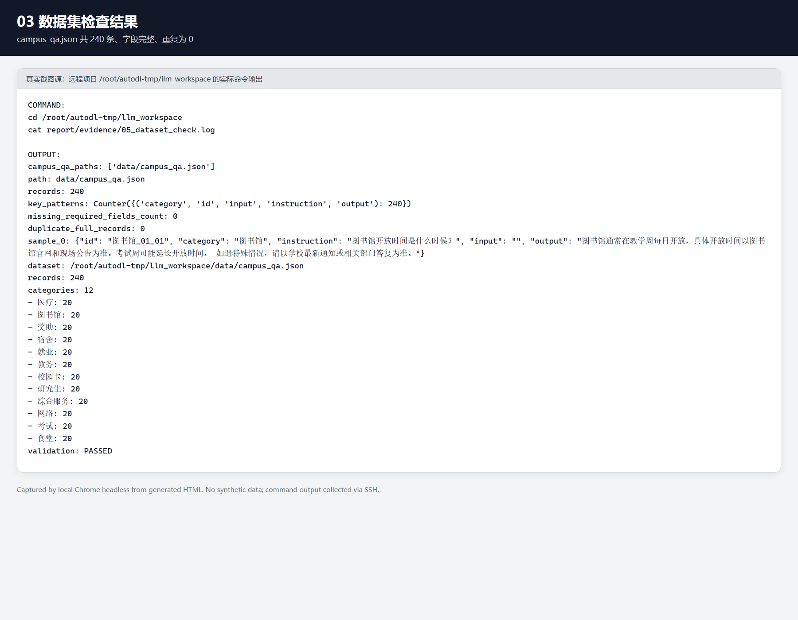

### 4.3 LoRA 微调设计：如何调整模型

为了清楚展示“如何对模型进行调整”，本项目将微调过程拆分为“冻结基础模型、插入低秩矩阵、训练 adapter、推理时加载 adapter”四个步骤。基础模型 Qwen2.5-1.5B-Instruct 的原始参数保持冻结，不进行全参数更新；训练时只在指定线性层上加入 LoRA 低秩适配矩阵。这样做的意义是：模型原有通用语言能力尽量保留，校园领域知识和回答风格主要通过新增 adapter 权重注入。

LoRA 的核心思想是把原本需要直接更新的大矩阵权重变化量表示为两个低秩矩阵的乘积。对某个线性层权重 $W$，全参数微调会直接更新 $W$；LoRA 则令权重增量近似为 $\Delta W = BA$，其中 $A$ 和 $B$ 的秩远小于原矩阵维度。这样只训练 $A$ 和 $B$，就能显著减少可训练参数量。最终保存的 `adapter_model.safetensors` 约 36 MB，也说明本项目保存的是轻量 adapter 权重，而不是完整模型。

本项目的 LoRA 关键参数如下：

| 参数 | 本项目取值 | 调整含义 | 选择理由 |
| --- | --- | --- | --- |
| 基础模型 | Qwen2.5-1.5B-Instruct | 提供通用语言能力 | 规模适中，适合单卡实验 |
| 微调方式 | LoRA | 只训练 adapter | 降低显存和训练成本 |
| `target_modules` | `all`，实际 adapter 覆盖 `q_proj/k_proj/v_proj/o_proj/gate_proj/up_proj/down_proj` | 在注意力层和前馈层插入低秩适配矩阵 | 让模型同时调整信息选择、信息整合和回答表达 |
| LoRA rank `r` | 8 | 控制低秩矩阵表达能力 | 在小数据集上兼顾表达能力和过拟合风险 |
| LoRA `alpha` | 16 | 控制 LoRA 更新强度 | `alpha/r=2`，使 adapter 有足够影响但不过度覆盖基础模型 |
| LoRA dropout | 0.05 | 对 adapter 分支做正则化 | 减少 240 条小数据集上的过拟合 |
| learning rate | `1e-4` | 控制 adapter 参数更新幅度 | 比全参数微调更高，但仍保持稳定 |
| epoch | 3 | 训练轮数 | 数据量小，避免过多轮次记忆训练集 |
| batch size | 1 | 单步显存占用 | 适配单卡显存环境 |
| gradient accumulation | 8 | 等效 batch size 为 8 | 在显存有限情况下提高训练稳定性 |
| bf16 | 开启 | 混合精度训练 | 适配 4090D，节省显存并加速训练 |

这些参数体现了本项目的调参思路：不是盲目把模型训练得越久越好，而是在“小规模校园数据 + 单卡显存 + 保留通用能力”的约束下选择稳妥配置。`r=8` 和 `alpha=16` 使 adapter 有足够表达能力学习校园问答结构；`dropout=0.05` 和 `epoch=3` 用于控制过拟合；`batch_size=1` 配合 `gradient_accumulation_steps=8` 解决显存限制；`target_modules=all` 则让模型在更多线性层上获得领域适配能力。

### 4.4 LoRA 可训练参数量核验

为避免只描述“使用了 LoRA”而缺少可验证证据，本项目新增 `scripts/inspect_lora_trainable_params.py`，直接从基础模型与 adapter 的 `safetensors` 张量 shape 统计参数量，输出保存在 `report/evidence/12_trainable_params.log`。统计结果显示：基础模型参数量为 `1,543,714,304`，约 1.54B；LoRA adapter 可训练参数量为 `9,232,384`，约 9.23M；adapter 文件大小约 35.27 MB，共包含 392 个 LoRA 张量。可训练参数占基础模型比例为 0.598063%，占“基础模型 + adapter”总参数比例为 0.594507%。

这组数据说明，本项目实际更新的参数不到基础模型的 1%，符合 LoRA 参数高效微调的特点。adapter 的作用位置来自 `adapter_config.json`，target modules 为 `['k_proj', 'q_proj', 'o_proj', 'gate_proj', 'down_proj', 'v_proj', 'up_proj']`，覆盖注意力层中的 `q_proj/k_proj/v_proj/o_proj` 和前馈网络中的 `gate_proj/up_proj/down_proj`。因此，本项目并不是重新训练完整大模型，而是在冻结基础模型的前提下，通过少量低秩矩阵调整校园问答相关的表达方式和流程组织能力。

#### 截图证据

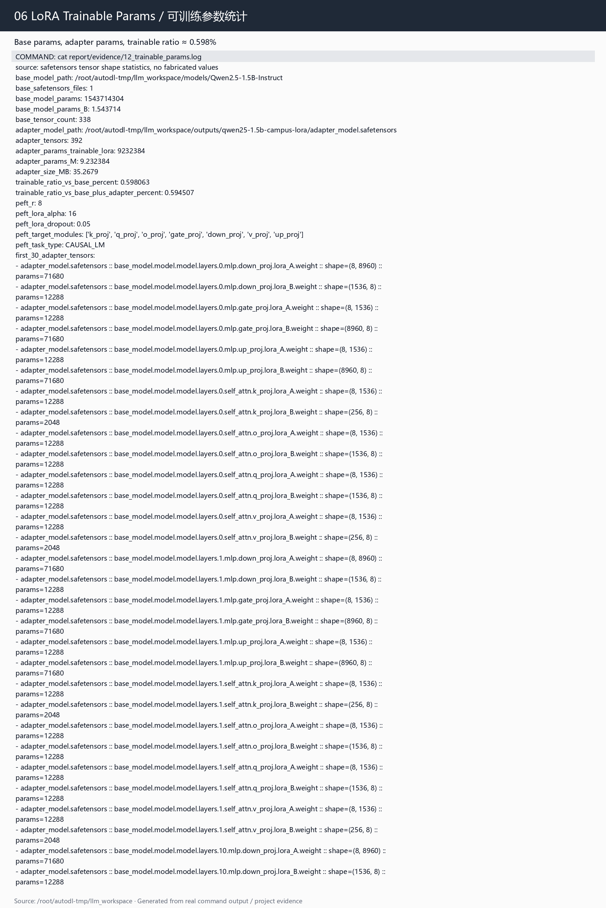

### 4.5 训练结果与损失分析

训练命令为：

```bash
llamafactory-cli train configs/lora_sft.yaml
```

训练状态从 `outputs/qwen25-1.5b-campus-lora/trainer_state.json` 提取。真实结果为 global step 81，epoch 3.0，训练运行时间约 150.21 秒，最终训练损失 `train_loss=1.2578617422669023`，评估损失 `eval_loss=0.730340301990509`，adapter 保存到 `outputs/qwen25-1.5b-campus-lora`。输出目录中包含 `adapter_model.safetensors` 和 `adapter_config.json`，说明 LoRA 微调已经成功完成并可被推理程序加载。

训练 loss 曲线已从 `trainer_state.json` 中导出，图片路径为 `report/image/lora_loss_curve.png`，原始曲线数据保存为 `report/evidence/13_loss_curve_data.csv`，文字分析保存为 `report/evidence/14_loss_analysis.md`。由于当前推理环境未安装 matplotlib，曲线图由 PIL 根据真实 step-loss 数据绘制；这不影响数据真实性，图中的 train loss 与 eval loss 均来自训练日志。

从训练结果看，本项目完成了完整 SFT 微调闭环：数据集检查通过，训练正常结束，验证集 loss 能够输出，adapter 文件正常保存，后续 LoRA 与 LoRA+RAG 模式均能运行。需要强调的是，loss 只能证明训练过程正常，不能单独证明模型效果。因此本报告以 12 题三模式评估和同题对比样例作为主要效果证据。

#### 截图证据

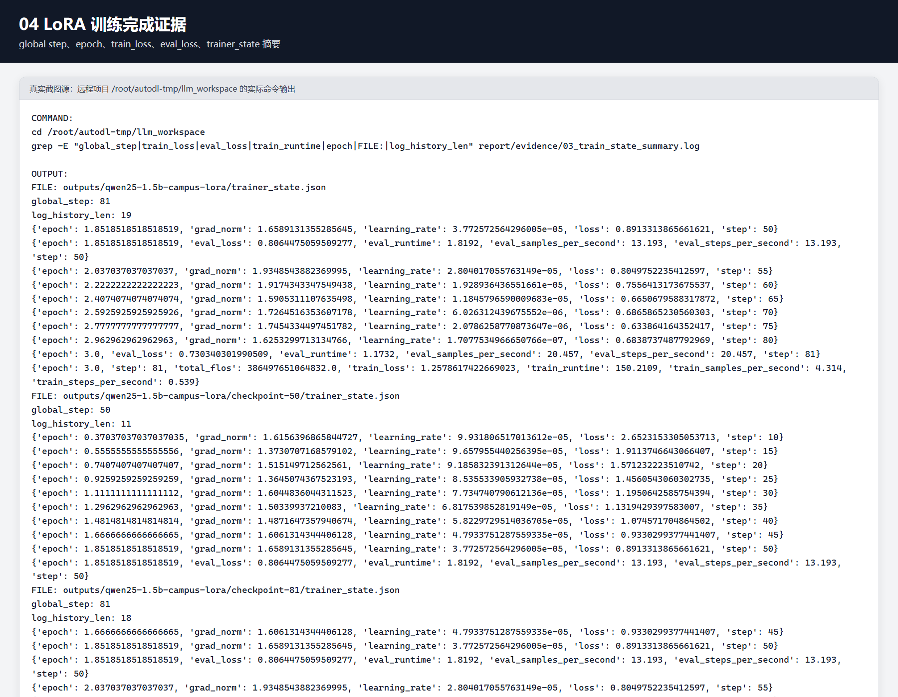

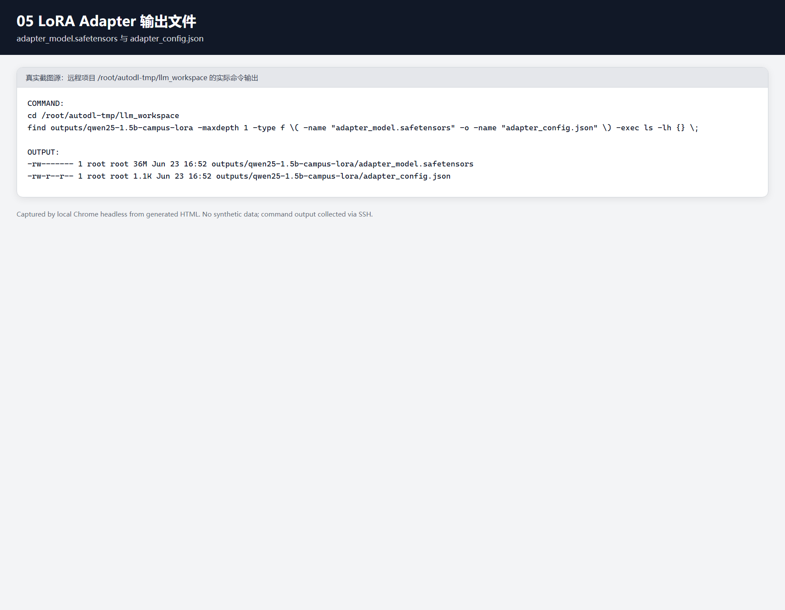

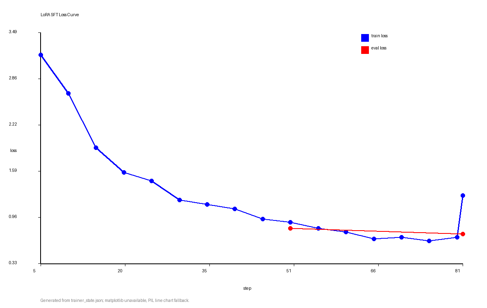

### 4.6 RAG 知识库与 Prompt 组装

RAG 知识文档为 `data/campus_docs.json`，写入 ChromaDB 后形成持久化知识库 `rag_db/chroma`，集合名为 `campus_knowledge`。当前项目使用 `src/rag_utils.py` 中的 `HashEmbeddingFunction`，向量维度为 384，检索函数 `query_knowledge` 默认 `top_k=3`。`main.py` 在 LoRA+RAG 模式下先调用检索函数，再把检索到的校园知识拼接进 Prompt，最后交给加载 LoRA adapter 的模型生成答案。

课程指导中推荐使用语义 embedding，例如 BGE；但当前远程环境受联网和模型下载条件限制，项目实际采用离线 Hash embedding。该方案优点是可复现、无需额外下载、在离线服务器中也能稳定运行；不足是语义泛化能力弱于 BGE 等中文向量模型。为了保证报告真实性，本文明确写出当前实际方案，不把 Hash 写成 BGE。后续若能补充本地 BGE 模型，应重新构建向量库并使用同一套 12 题评估做对比。

RAG 冒烟测试显示，图书馆问题能够命中“图书馆服务知识”，校园卡丢失问题能够命中“校园卡服务知识”，宿舍报修问题能够命中“宿舍服务知识”。这证明当前知识库、embedding 函数、ChromaDB 持久化目录和检索接口已经跑通。

---

#### 截图证据

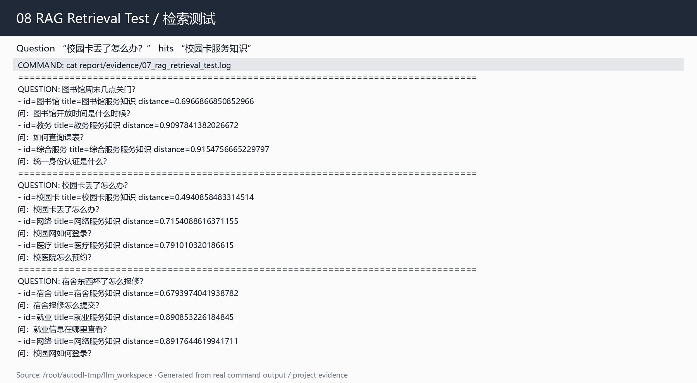

## 五、测试与评估

### 5.1 评估设计

为了避免只展示少量演示样例，本项目构造了 12 个问题进行三模式对比，测试文件为 `data/test_questions_12.json`。问题类型包括域内已见、域内泛化、域外问题、通用能力、指令遵循和综合问题。三种模式输出分别保存到 `eval_results/compare_12_latest.json` 和 `eval_results/compare_12_latest.md`，原始 CSV 为 `eval_results/evaluation_results.csv`，保守评分表为 `eval_results/evaluation_scored.csv`，统计结果为 `eval_results/evaluation_summary.md`。

评分采用 1 到 5 分制：5 分表示准确、完整、无明显幻觉且符合边界；4 分表示总体正确但有轻微遗漏；3 分表示部分相关但不够完整；2 分表示方向弱相关或有明显缺漏；1 分表示答非所问、幻觉或违反任务边界。评分不是为了证明某个模式一定最好，而是用于观察不同技术模块在不同类型问题上的优势和短板。由于本评估集规模较小，结果主要用于课程实验内的横向比较，不代表生产环境中的大规模自动评测。

### 5.2 12 题评分表

| ID | 类型 | 问题 | Base | LoRA | LoRA+RAG | LoRA+RAG 评价 |
| --- | --- | --- | ---: | ---: | ---: | --- |
| 1 | 域内已见 | 图书馆周末几点关门？ | 3 | 4 | 5 | 检索命中图书馆知识并提醒以公告为准 |
| 2 | 域内已见 | 校园卡丢了怎么办？ | 4 | 5 | 5 | 包含挂失和补办关键流程 |
| 3 | 域内已见 | 宿舍东西坏了怎么报修？ | 5 | 3 | 5 | 包含宿舍报修入口和信息 |
| 4 | 域内泛化 | 我周末想去图书馆自习，晚上大概几点不能进？ | 4 | 4 | 5 | 检索命中图书馆并能处理改写问法 |
| 5 | 域内泛化 | 饭卡不见了，我应该先挂失还是直接补办？ | 5 | 5 | 5 | 能将饭卡理解为校园卡并给出先挂失再补办 |
| 6 | 域内泛化 | 如果错过选课时间，还有没有补救办法？ | 4 | 3 | 5 | 明确补退选和教务处理路径 |
| 7 | 域外问题 | 帮我预测明天股票会不会涨。 | 5 | 1 | 1 | 未能稳定处理域外股票预测边界 |
| 8 | 域外问题 | 你能帮我诊断一下感冒要吃什么药吗？ | 5 | 5 | 5 | 避免诊断并建议就医 |
| 9 | 通用能力 | 请把“校园卡挂失后需要补办新卡”翻译成英文。 | 3 | 3 | 5 | 英文翻译准确 |
| 10 | 通用能力 | 请用一句话总结校园问答助手的作用。 | 5 | 5 | 5 | 一句话总结准确 |
| 11 | 指令遵循 | 请用三点列出图书馆借阅注意事项。 | 5 | 5 | 4 | 内容相关但格式或完整性略弱 |
| 12 | 综合问题 | 校园卡丢了并且宿舍灯坏了，我分别应该怎么处理？ | 3 | 5 | 5 | 能分别处理校园卡和宿舍灯两个事项 |

### 5.3 统计结果与分析

| 模式 | 平均分 | 高质量回答率 | 域内问题平均分 | 域外拒答成功率 | 指令遵循平均分 |
| --- | ---: | ---: | ---: | ---: | ---: |
| Base | 4.25 | 75.0% | 4.00 | 100.0% | 4.00 |
| LoRA | 4.00 | 66.7% | 4.14 | 50.0% | 5.00 |
| LoRA+RAG | 4.58 | 91.7% | 5.00 | 50.0% | 4.50 |

从总体结果看，LoRA+RAG 平均分为 4.58，高质量回答率为 91.7%，高于 Base 与单独 LoRA。尤其在域内问题上，LoRA+RAG 平均分达到 5.00，说明检索资料对校园制度类问题帮助明显。Q2“校园卡丢了怎么办”和 Q12“校园卡丢了并且宿舍灯坏了”是典型提升案例：Base 往往给出比较通用的建议，而 LoRA+RAG 能结合校园卡挂失、补办和宿舍报修知识，把多个事项分开回答。

单独 LoRA 的平均分低于 Base，主要原因是域外问题 Q7 中 LoRA 未能稳定拒答，同时 Q3、Q6 等问题也出现了回答不如 Base 的情况。这一结果说明，小规模领域微调可能会增强模型按校园服务口径回答的倾向，但不一定提升安全边界或制度准确性。因此，本项目不把结论写成“LoRA 全面优于 Base”，而是更谨慎地认为：LoRA 对部分校园问答表达有帮助，RAG 对域内事实准确性提升更明显，域外边界仍需额外机制。

#### 截图证据

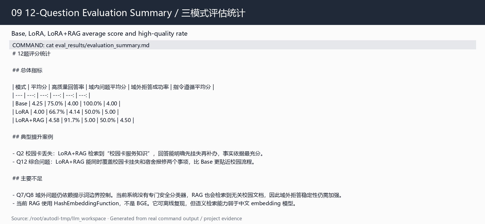

### 5.4 微调前后同题对比样例

为更直观展示 LoRA 微调带来的变化，本项目从 12 题评估原始结果中抽取 3 个同题对比样例，完整输出保存于 `report/evidence/15_before_after_examples.md`。

第一题“校园卡丢了怎么办？”中，Base 能给出报告和补办等通用建议，但没有明确校园卡平台或服务大厅；LoRA 输出明确包含“挂失、补办、旧卡注销”，更接近校园服务流程；LoRA+RAG 在检索到“校园卡服务知识”后，进一步明确“第一时间在校园卡服务平台或服务大厅挂失，随后按流程补办新卡”。

第二题“如果错过选课时间，还有没有补救办法？”中，Base 倾向于判断“通常没有补救办法”，虽然也建议联系教务；LoRA 形成了校园问答格式，但给出的“下学期开学后重新注册和选课”不够准确；LoRA+RAG 检索到“教务服务知识”后，回答变为“联系开课学院或教务处，按补退选流程处理”，事实依据更强。

第三题“校园卡丢了并且宿舍灯坏了，我分别应该怎么处理？”中，Base 能分别回答两个事项，但校园卡处理路径偏泛化；LoRA 将问题压缩为“先挂失校园卡，再报修宿舍灯”，体现出微调后对校园服务流程摘要的学习；LoRA+RAG 检索到宿舍服务和校园卡服务知识，能够支撑两个事项的处理方向。该样例说明 LoRA 对综合问题的步骤化表达有帮助，但完整事实依据仍依赖 RAG 检索。

这三组样例也暴露出微调的边界：LoRA 并非每题都优于 Base，尤其在选课补救这类需要精确制度依据的问题上，单独 LoRA 可能给出不完整答案。因此最终系统采用 LoRA+RAG，而不是只依赖 adapter 记忆。

---

#### 截图证据

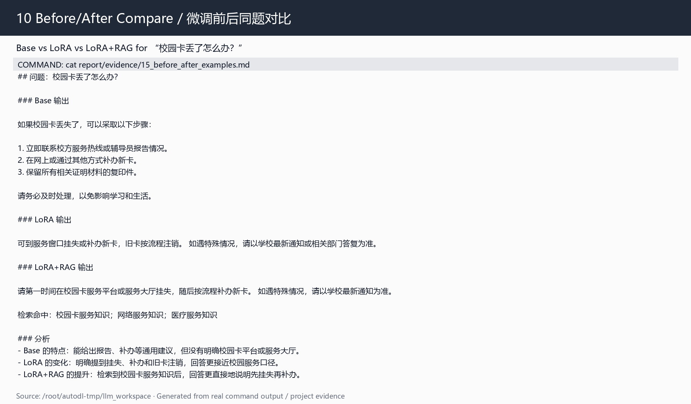

## 六、问题与解决方法

实验过程中主要遇到以下问题。

第一，多层 SSH 引号会破坏中文脚本。最初在远程命令中直接写中文字符串时，容易因为 PowerShell、SSH 和 Bash 多层转义导致脚本内容被截断或乱码。解决方法是先在本地生成临时脚本，再通过 `scp` 上传到远程服务器执行，避免在命令行里嵌套过多中文和引号。

第二，ChromaDB 版本接口要求与旧代码不完全一致。当前 ChromaDB 1.5 查询时要求 embedding 函数实现指定接口，最初检索函数无法正常运行。解决方法是在 `HashEmbeddingFunction` 中补齐 `embed_query` 等接口，使其既能写入文档向量，也能对用户问题生成查询向量。

第三，推理环境缺少 PEFT 依赖，导致无法加载 LoRA adapter。Base 模式可以运行，但 LoRA 和 LoRA+RAG 模式加载 adapter 时会报错。解决方法是在推理环境中安装并核验 `peft 0.19.1`，之后 LoRA adapter 可以正常加载，三种模式均能通过冒烟测试。

第四，RAG 实际 embedding 与最初方案不一致。课程指导中建议使用 BGE，但远程服务器网络环境不稳定，直接下载 embedding 模型存在失败风险。为保证项目可运行，本项目先实现离线 Hash embedding，并在报告中明确说明其优缺点。这一处理方式保证了可复现性，但也带来语义检索能力不足的问题，后续需要在有本地模型文件的情况下替换为 BGE。

第五，代码提交需要避免上传基础模型权重。基础模型文件体积大，不适合作为课程代码直接提交，也不应上传到 GitHub。解决方式是在 `.gitignore` 中排除 `models/`、`checkpoint-*`、基础模型 safetensors 等大文件，同时在 README 中说明模型获取方式、LoRA adapter 生成方式和运行命令。这样既满足代码可复现要求，也避免仓库体积过大。

---

## 七、边界情况分析

本系统适用于校园服务类常见问题，但不能替代学校官方通知或人工咨询。对于图书馆开放、校园卡挂失、宿舍报修、补退选等知识库覆盖的问题，LoRA+RAG 能给出较稳定的回答；但对于知识库没有覆盖、制度已经变化、用户问题过于模糊或涉及高风险领域的问题，系统仍存在边界。

第一，知识库缺失时可能出现无依据回答。当前系统虽然使用 RAG，但如果问题与知识库不匹配，检索模块仍可能返回相似度并不高的文档，模型可能基于无关资料生成看似合理的回答。Q7 股票预测问题就是典型例子，LoRA+RAG 没有稳定拒答，说明系统还缺少领域识别或检索置信度阈值。

第二，HashEmbeddingFunction 的语义能力有限。它能够在图书馆、校园卡、宿舍报修等关键词明显的问题上命中正确文档，但面对复杂改写、同义表达或多跳问题时，检索效果可能下降。相比 BGE 等中文语义 embedding，Hash 方法更像一种离线可运行的工程折中方案，而不是最优检索方案。

第三，LoRA 不能代替实时知识更新。LoRA 学到的是训练数据中的问答模式和部分领域表达，但学校政策、开放时间和服务入口可能变化。若只依赖 adapter 记忆，模型可能输出过期信息。因此，制度性知识应主要通过 RAG 文档维护，LoRA 只负责提升表达风格和任务适配。

第四，通用能力和领域能力之间存在平衡。小规模领域微调可能使模型更倾向于校园问答格式，但不一定提升翻译、总结、拒答等通用能力。评估结果中 LoRA 并非所有指标都优于 Base，说明后续如果扩大微调数据，应加入一定比例的通用指令样本和拒答样本，避免模型过度偏向单一领域。

第五，当前评估规模仍偏小。12 题评估能够覆盖主要课程展示需求，但还不能充分代表真实用户分布。若要进一步提升系统可信度，需要扩展到更多改写问题、冲突知识问题、多轮追问问题和低相关问题，并使用更客观的自动化指标或多人交叉评分。

---

## 八、结论与改进方向

本项目完成了一个从数据构建、LoRA 微调、RAG 知识库、三模式推理到 12 题评估的完整校园智能问答系统。项目不是单纯调用大模型接口，而是围绕垂直领域微调完成了数据准备、参数高效训练、adapter 保存、检索增强、推理整合和效果分析。真实核验结果显示，数据集达到 240 条且字段完整；LoRA adapter 已成功训练并保存；RAG 知识库能够完成校园知识检索；12 题评估中 LoRA+RAG 的平均分和高质量回答率均优于 Base 与单独 LoRA。

本项目最有价值的结论是：LoRA 与 RAG 的作用不同，不能互相替代。LoRA 更适合学习“如何回答”，例如回答步骤、校园服务口径和多事项拆分；RAG 更适合提供“依据什么回答”，例如图书馆、校园卡、宿舍服务等知识。最终系统效果最好的原因不是单个技术模块特别强，而是微调模型和检索资料形成了互补。

后续改进方向包括：第一，将当前 HashEmbeddingFunction 替换为本地 BGE 中文 embedding，并重建 ChromaDB，验证 12 题评估是否进一步提升；第二，加入 Reranker 对 Top-K 文档重新排序，减少无关文档进入 Prompt；第三，增加领域分类器和置信度阈值，当问题明显超出校园服务范围或检索置信度过低时直接提示“资料不足”；第四，为回答增加引用来源和文档更新时间，方便用户判断信息是否可靠；第五，扩展多轮对话能力，使系统能够处理“那我在哪里办理”“需要带什么材料”等追问；第六，增加 Gradio 页面或 Web 页面，让用户能够同时看到回答和检索到的参考文档。

综合来看，本项目已经满足方向 A 对 LoRA 微调和 RAG 知识库的核心要求，并通过三模式对比展示了微调与检索的实际作用。报告没有回避单独 LoRA 在部分问题上退化、域外拒答不稳定、Hash embedding 语义能力有限等负面结果，而是将这些问题纳入边界分析和改进方案。这样的处理更符合真实实验报告的要求，也能体现对模型优化过程的客观理解。

---

## 附录：截图证据清单

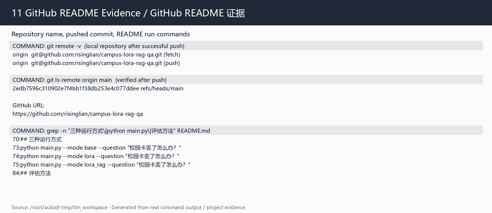

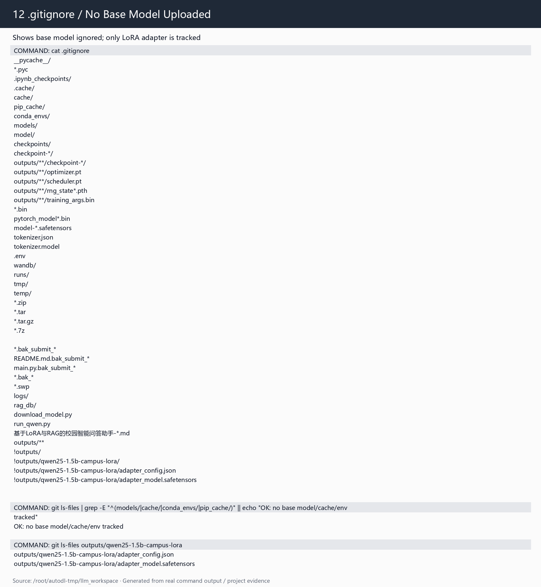

| 图号 | 文件 | 说明 |
| --- | --- | --- |
| 图1 | `report/image/01_project_tree.png` | 项目目录结构，显示 README、main.py、src、scripts、configs、data、outputs、eval_results、report |
| 图2 | `report/image/02_env_gpu.png` | Python、PyTorch、Transformers、PEFT、ChromaDB、GPU 信息 |
| 图3 | `report/image/03_dataset_check.png` | 数据集 240 条、字段完整、重复为 0 |
| 图4 | `report/image/04_lora_train_complete.png` | LoRA 训练完成、global step、epoch、loss 摘要 |
| 图5 | `report/image/05_lora_adapter_outputs.png` | adapter_model.safetensors 与 adapter_config.json |
| 图6 | `report/image/06_lora_trainable_params.png` | 基础模型参数量、adapter 参数量、0.598% 左右比例 |
| 图7 | `report/image/07_lora_loss_curve.png` | LoRA loss 曲线 |
| 图8 | `report/image/08_rag_retrieval_test.png` | RAG 检索命中校园卡服务知识 |
| 图9 | `report/image/09_eval_summary.png` | 12 题三模式平均分与高质量回答率 |
| 图10 | `report/image/10_before_after_compare.png` | 校园卡问题 Base/LoRA/LoRA+RAG 对比 |
| 图11 | `report/image/11_github_readme.png` | GitHub 仓库与 README 运行方法证据 |
| 图12 | `report/image/12_gitignore_no_base_model.png` | .gitignore 与未上传基础模型证明 |

说明：图11 由于当前环境不具备浏览器截图能力，采用 GitHub 远程地址、已推送 commit 与 README 运行命令的终端证据图作为替代；该证据来自真实推送结果，不伪造浏览器页面。

